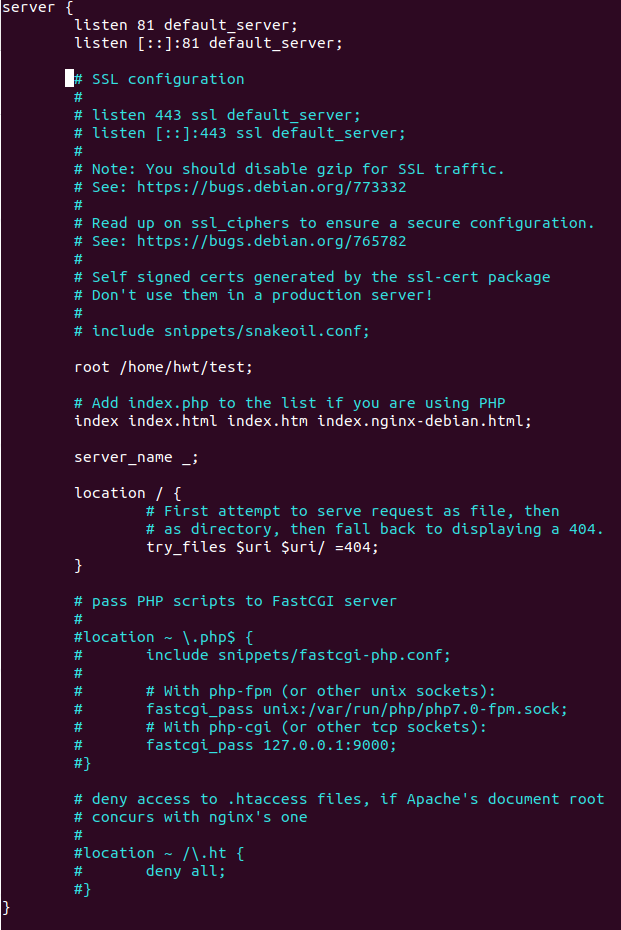

## 1. 使用sass
 - react默认就是支持Sass的
 - yarn add node-sass --save-dev
 - node-sass版本号和react版本具有兼容性问题，通过下载node-sass 4.14.1解决问题

## 2. 导入的快捷方式

rfc(函数组件)

rcc(类组件)

## 3. 开发中遇到的问题

- 首页白屏

- 如何实现二维码登录

- 如何对密码进行加密

- 　
## 4. ES6 模板字符串 来控制多个class　√
使用数组,返回null或者''会出现问题，可以是使用join来处理

## 5. 微信测试号

- 微信开放平台无法接入验证登录
- 目前使用别人的登录
- https://developers.weixin.qq.com/doc/oplatform/Website_App/WeChat_Login/Wechat_Login.html
- 使用微信登录,有限制
- 自己开发一个app进行扫码

## 6. react-router　√

## 7. 拓展运算符　{3-zujian}

## 8. 如何实现按需加载，从而优化性能

## 9. 路由保护 √

## 10. 怎么部署到服务器上

- 腾讯云

- nginx

    > 下载nginx
      - yum  install nginx 或者
      - sudo apt-get install nginx

    > 配置nginx.conf中的server文件
      - 默认安装路径　/etc/nginx

    > 修改nginx配置文件 
    > 
    - 修改监听的端口－listen 81
    - 修改默认打开的页面路径 - root /home/hwt/test

 ## 11. 怎么把图片部署到服务器进行远程请求

## 12. 

 

## 2. 我想做什么、博客、空间、还是聊天、？

## 3. 可以先做一个好看的主页

## 4. 分类中再加一个博客

## 5. 聊天

